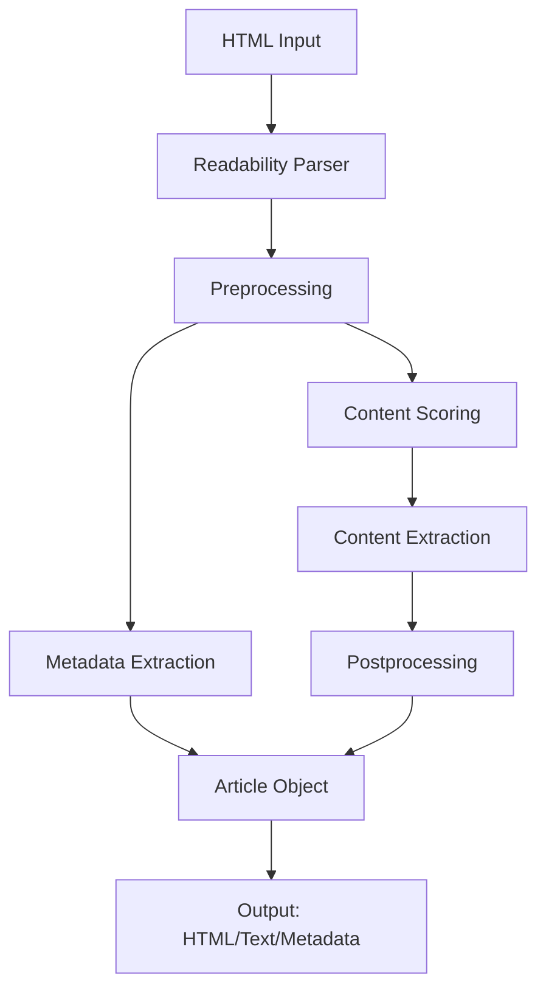
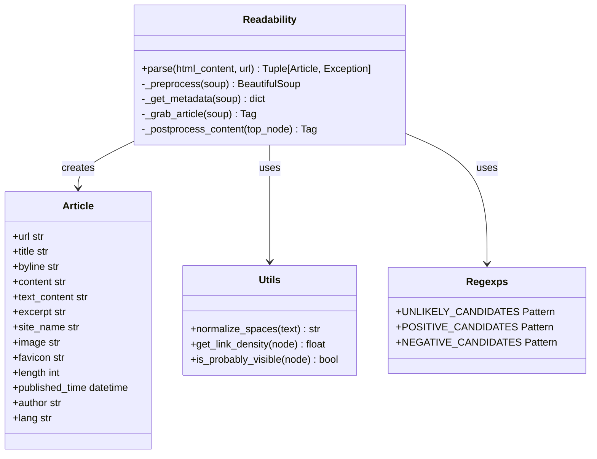

# System Patterns: Python Readability

## System Architecture
The Python Readability library follows a modular architecture with clear separation of concerns:

## Key Components

### 1. Core Parser (`readability/parser.py`)
- Main `Readability` class that orchestrates the parsing process
- Entry point method `parse()` that returns an `Article` object or error
- Handles the overall flow of content extraction

### 2. Data Models (`readability/models.py`)
- `Article` dataclass containing extracted content and metadata
- Custom error classes for different failure modes

### 3. Utilities (`readability/utils.py`)
- Helper functions for text normalization, URL handling, etc.
- Shared functionality used across the library

### 4. Regular Expressions (`readability/regexps.py`)
- Compiled regular expressions for various pattern matching operations
- Organized by usage (preprocessing, scoring, cleaning)

### 5. CLI Interface (`cli/main.py`)
- Command-line interface for using the library
- Handles input/output and formatting options

## Key Technical Decisions

### 1. Error Handling Pattern
- Use explicit error returns (`Tuple[Optional[Article], Optional[Exception]]`) at API boundaries
- Use exceptions internally for control flow
- This maintains compatibility with Go's error handling pattern while being Pythonic internally

### 2. HTML Parsing
- Use BeautifulSoup with lxml parser for HTML parsing
- Map Go DOM traversal methods to BeautifulSoup equivalents
- Attach scoring information to nodes using BeautifulSoup's custom attributes

### 3. Data Structure Choices
- Use Python dataclasses for clean, type-hinted data models
- Return immutable objects to prevent unexpected modifications

### 4. Testing Approach
- Reuse test cases from the original Go implementation
- Use pytest for test infrastructure
- Parameterized tests for running the same test logic against multiple test cases

### 5. Dependency Management
- Use modern Python packaging tools (Poetry or pyproject.toml)
- Minimal dependencies to keep the library lightweight

## Component Relationships

## Processing Flow
1. **Input Processing**: Parse HTML into BeautifulSoup object
2. **Preprocessing**: Clean up document (remove scripts, styles, etc.)
3. **Metadata Extraction**: Extract title, author, date, etc.
4. **Content Scoring**: Score nodes based on content quality heuristics
5. **Candidate Selection**: Identify the highest-scoring content node
6. **Content Extraction**: Extract the main content and related nodes
7. **Postprocessing**: Clean up the extracted content
8. **Output Generation**: Create the final Article object with HTML and text content
