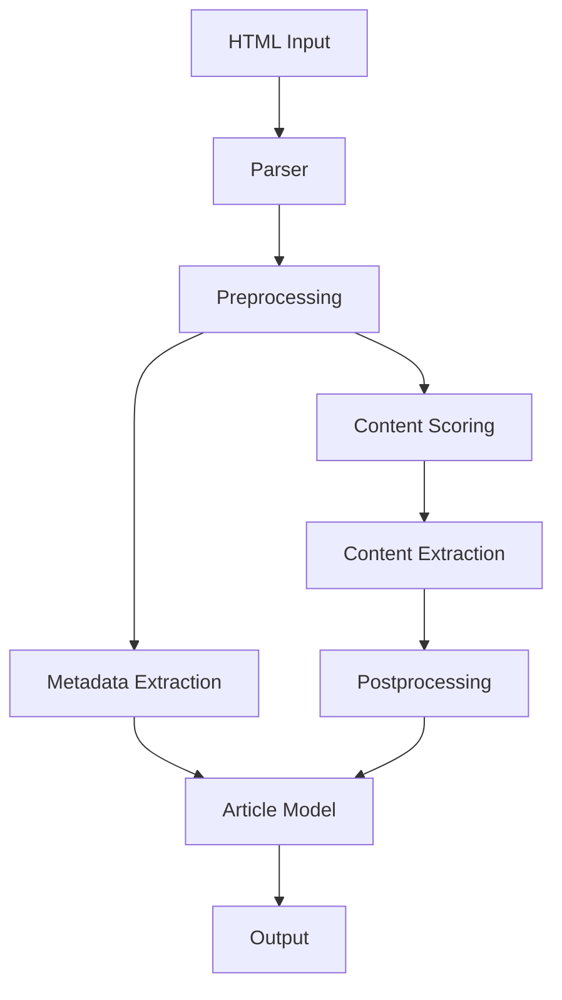

# System Patterns for Python Readability

## System Architecture

The Python Readability library follows a modular architecture with clear separation of concerns. The main components are:

1. **Parser**: The main entry point for the library, responsible for orchestrating the parsing process.
2. **Models**: Data structures for representing articles and metadata.
3. **Preprocessing**: Utilities for cleaning and preparing HTML for content extraction.
4. **Scoring**: Algorithms for identifying the main content of a page.
5. **Postprocessing**: Utilities for cleaning and formatting the extracted content.
6. **CLI**: Command-line interface for using the library.



## Key Technical Decisions

### 1. BeautifulSoup for HTML Parsing

We use BeautifulSoup with the lxml parser for HTML parsing, as it provides a robust and Pythonic API for traversing and manipulating HTML documents. This is a key difference from the Go implementation, which uses its own DOM implementation.

### 2. Explicit Error Returns

Following the Go implementation's pattern, we use explicit error returns rather than exceptions for the main API. This makes the API more predictable and easier to use, especially for users coming from Go.

```python
article, error = parser.parse(html_content, url=url)
if error:
    # Handle error
```

### 3. Dataclasses for Models

We use Python's dataclasses for representing articles and metadata, which provides a clean and type-hinted API.

```python
@dataclass
class Article:
    url: str
    title: str
    byline: Optional[str] = None
    content: str = ""
    text_content: str = ""
    excerpt: Optional[str] = None
    site_name: Optional[str] = None
    image: Optional[str] = None
    favicon: Optional[str] = None
    length: int = 0
    published_time: Optional[datetime] = None
    author: Optional[str] = None
    lang: Optional[str] = None
```

### 4. Regular Expression Translation

The Go implementation uses RE2 regular expressions, which have a slightly different syntax than Python's re module. We carefully translate these regular expressions to ensure they work correctly in Python.

### 5. DOM Traversal Mapping

The Go implementation uses its own DOM traversal methods, which we map to BeautifulSoup's methods. This ensures that the content extraction algorithm works the same way in both implementations.

| Go DOM Method | BeautifulSoup Equivalent |
|---------------|--------------------------|
| FirstElementChild | .find() |
| NextElementSibling | .find_next_sibling() |
| PreviousElementSibling | .find_previous_sibling() |
| Children | .children |
| Parent | .parent |

## Design Patterns

### 1. Builder Pattern

The `Readability` class uses a builder-like pattern for configuration, allowing users to customize the parsing process.

```python
parser = Readability()\
    .with_min_text_length(25)\
    .with_retry(True)\
    .with_url_rewriting(True)
```

### 2. Strategy Pattern

The scoring algorithm uses a strategy pattern, allowing different scoring strategies to be used for different types of content.

```python
class ScoringStrategy(ABC):
    @abstractmethod
    def score(self, node: Tag) -> float:
        pass

class DefaultScoringStrategy(ScoringStrategy):
    def score(self, node: Tag) -> float:
        # Default scoring algorithm
        pass

class NewsArticleScoringStrategy(ScoringStrategy):
    def score(self, node: Tag) -> float:
        # News article specific scoring algorithm
        pass
```

### 3. Chain of Responsibility

The preprocessing and postprocessing steps use a chain of responsibility pattern, where each step can modify the DOM tree and pass it to the next step.

```python
class ProcessingStep(ABC):
    @abstractmethod
    def process(self, soup: BeautifulSoup) -> BeautifulSoup:
        pass

class RemoveScripts(ProcessingStep):
    def process(self, soup: BeautifulSoup) -> BeautifulSoup:
        for script in soup.find_all("script"):
            script.decompose()
        return soup

class RemoveStyles(ProcessingStep):
    def process(self, soup: BeautifulSoup) -> BeautifulSoup:
        for style in soup.find_all("style"):
            style.decompose()
        return soup
```

## Component Relationships

### Parser and Models

The Parser is responsible for creating and populating Article objects. It uses the various processing components to extract content and metadata from the HTML.

### Preprocessing and Scoring

The preprocessing steps prepare the HTML for scoring by removing unnecessary elements and normalizing the content. The scoring algorithm then uses this preprocessed HTML to identify the main content.

### Scoring and Content Extraction

The scoring algorithm assigns scores to different parts of the HTML based on various heuristics. The content extraction component then uses these scores to identify and extract the main content.

### Postprocessing and Output Generation

The postprocessing steps clean up the extracted content, removing any remaining unnecessary elements and formatting the content for output. The output generation component then creates the final HTML and plain text versions of the content.

## Error Handling System

The error handling system follows a robust design pattern inspired by React's error boundaries:

### 1. Error Boundary Pattern

We use a context manager-based error boundary pattern that provides a consistent way to handle errors across the codebase:

```python
with ErrorBoundary("operation_name", ErrorType.PERMISSION) as eb:
    eb.add_context("file_path", path)
    # Code that might fail
    with open(path, "r") as f:
        content = f.read()
```

This pattern allows for:
- Centralized error handling logic
- Consistent error reporting
- Contextual information capture
- Clean error recovery paths

### 2. Error Type Classification

Errors are classified using an Enum to provide specific exit codes:

```python
class ErrorType(Enum):
    SUCCESS = 0
    INPUT = 1        # Input-related errors
    NETWORK = 2      # Network errors
    PARSING = 3      # Content parsing errors
    OUTPUT = 4       # Output-related errors
    PERMISSION = 5   # Permission errors
    # ...
```

### 3. Automatic Error Mapping

The system automatically maps Python exceptions to the appropriate error types:

```python
# Determine the most appropriate error type based on the exception
error_type = self.error_type
if isinstance(exception, PermissionError):
    error_type = ErrorType.PERMISSION
elif isinstance(exception, TimeoutError):
    error_type = ErrorType.TIMEOUT
```

### 4. Nested Error Boundaries

The system supports nested error boundaries using a custom exception type:

```python
class ErrorBoundaryExit(Exception):
    def __init__(self, error_type: ErrorType, message: str):
        self.error_type = error_type
        self.message = message
        super().__init__(message)
```

This allows inner error boundaries to propagate errors to outer boundaries with appropriate error type information.

### 5. Decorator Support

The system provides a decorator for wrapping functions with error boundaries:

```python
@with_error_boundary(ErrorType.INPUT)
def read_file(path: str) -> str:
    with open(path, "r") as f:
        return f.read()
```

## Testing Strategy

The testing strategy focuses on ensuring that the Python implementation behaves the same way as the Go implementation. This is achieved through:

1. **Unit Tests**: Testing individual components in isolation.
2. **Integration Tests**: Testing the interaction between components.
3. **End-to-End Tests**: Testing the entire parsing process with real-world HTML.
4. **Comparison Tests**: Comparing the output of the Python implementation with the Go implementation for the same input.

### Test Organization Patterns

We've implemented a comprehensive test organization strategy to improve test execution efficiency and developer workflow:

1. **Functional Area Categorization**

Tests are categorized by functional area to allow targeted testing:

```python
class FunctionalArea(Enum):
    """Functional areas for test categorization."""
    HTML_PARSING = "HTML Parsing"
    METADATA_EXTRACTION = "Metadata Extraction"
    CONTENT_IDENTIFICATION = "Content Identification"
    CONTENT_CLEANING = "Content Cleaning"
    URL_HANDLING = "URL Handling"
    VISIBILITY_DETECTION = "Visibility Detection"
    TEXT_NORMALIZATION = "Text Normalization"
    REAL_WORLD = "Real-world Websites"
```

2. **Test Subsetting**

Tests are grouped into "fast" and "slow" categories to optimize execution time:

```python
# Group areas into performance categories
FAST_AREAS = [
    FunctionalArea.HTML_PARSING,
    FunctionalArea.METADATA_EXTRACTION,
    # ...other non-real-world areas
]

SLOW_AREAS = [
    FunctionalArea.REAL_WORLD
]
```

3. **Parallel Test Execution**

Tests can be run in parallel using pytest-xdist to improve execution speed:

```python
# Run tests in parallel with auto-detected number of cores
python scripts/run_tests.py --all --parallel

# Specify number of parallel jobs
python scripts/run_tests.py --all --parallel --jobs 4
```

4. **Debug Output Control**

Debug output generation can be disabled to improve test execution speed:

```python
# Skip debug output if disabled
if os.environ.get("DISABLE_DEBUG_OUTPUT") == "1":
    return None
```

5. **Command-Line Interface for Test Execution**

A dedicated script provides a user-friendly interface for running test subsets:

```python
def main():
    parser = argparse.ArgumentParser(description="Run targeted test subsets")
    
    group = parser.add_mutually_exclusive_group(required=True)
    group.add_argument("--all", action="store_true", help="Run all tests")
    group.add_argument("--fast", action="store_true", help="Run only fast tests")
    group.add_argument("--slow", action="store_true", help="Run only slow tests")
    
    # Add arguments for each functional area
    for area in FunctionalArea:
        flag = f"--{area.name.lower().replace('_', '-')}"
        group.add_argument(flag, action="store_true", 
                          help=f"Run only {area.value} tests")
```

### Dependency Mocking Patterns

To ensure reliable tests that don't depend on external systems, we use dependency mocking:

1. **File System Mocking**

We use pytest-mock to mock file system operations:

```python
def test_file_not_found(self, mocker):
    mock_open = mocker.patch("builtins.open")
    mock_open.side_effect = FileNotFoundError(2, "No such file", "test.txt")
    
    # Test code that uses open()
```

2. **Network Request Mocking**

We mock network requests to test error scenarios without making actual HTTP requests:

```python
def test_network_error(self, mocker):
    mock_get = mocker.patch("requests.get")
    mock_get.side_effect = requests.exceptions.ConnectionError("Connection refused")
    
    # Test code that uses requests.get()
```

3. **Parameterized Error Tests**

We use pytest's parameterization to test different error scenarios:

```python
@pytest.mark.parametrize("exception,expected_code", [
    (FileNotFoundError(2, "No such file", "test.txt"), ErrorType.INPUT.value),
    (PermissionError(13, "Permission denied", "test.txt"), ErrorType.PERMISSION.value),
])
def test_error_variations(self, mocker, exception, expected_code):
    # Test with different error types
```

The test suite includes a comprehensive set of test cases covering various types of content and edge cases.
