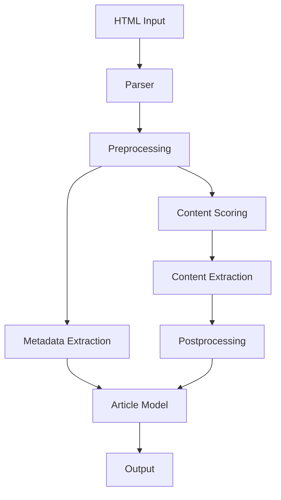

# System Patterns for Python Readability

## System Architecture

The Python Readability library follows a modular architecture with clear separation of concerns. The main components are:

1. **Parser**: The main entry point for the library, responsible for orchestrating the parsing process.
2. **Models**: Data structures for representing articles and metadata.
3. **Preprocessing**: Utilities for cleaning and preparing HTML for content extraction.
4. **Scoring**: Algorithms for identifying the main content of a page.
5. **Postprocessing**: Utilities for cleaning and formatting the extracted content.
6. **CLI**: Command-line interface for using the library.



## Key Technical Decisions

### 1. BeautifulSoup for HTML Parsing

We use BeautifulSoup with the lxml parser for HTML parsing, as it provides a robust and Pythonic API for traversing and manipulating HTML documents. This is a key difference from the Go implementation, which uses its own DOM implementation.

### 2. Explicit Error Returns

Following the Go implementation's pattern, we use explicit error returns rather than exceptions for the main API. This makes the API more predictable and easier to use, especially for users coming from Go.

```python
article, error = parser.parse(html_content, url=url)
if error:
    # Handle error
```

### 3. Dataclasses for Models

We use Python's dataclasses for representing articles and metadata, which provides a clean and type-hinted API.

```python
@dataclass
class Article:
    url: str
    title: str
    byline: Optional[str] = None
    content: str = ""
    text_content: str = ""
    excerpt: Optional[str] = None
    site_name: Optional[str] = None
    image: Optional[str] = None
    favicon: Optional[str] = None
    length: int = 0
    published_time: Optional[datetime] = None
    author: Optional[str] = None
    lang: Optional[str] = None
```

### 4. Regular Expression Translation

The Go implementation uses RE2 regular expressions, which have a slightly different syntax than Python's re module. We carefully translate these regular expressions to ensure they work correctly in Python.

### 5. DOM Traversal Mapping

The Go implementation uses its own DOM traversal methods, which we map to BeautifulSoup's methods. This ensures that the content extraction algorithm works the same way in both implementations.

| Go DOM Method | BeautifulSoup Equivalent |
|---------------|--------------------------|
| FirstElementChild | .find() |
| NextElementSibling | .find_next_sibling() |
| PreviousElementSibling | .find_previous_sibling() |
| Children | .children |
| Parent | .parent |

## Design Patterns

### 1. Builder Pattern

The `Readability` class uses a builder-like pattern for configuration, allowing users to customize the parsing process.

```python
parser = Readability()\
    .with_min_text_length(25)\
    .with_retry(True)\
    .with_url_rewriting(True)
```

### 2. Strategy Pattern

The scoring algorithm uses a strategy pattern, allowing different scoring strategies to be used for different types of content.

```python
class ScoringStrategy(ABC):
    @abstractmethod
    def score(self, node: Tag) -> float:
        pass

class DefaultScoringStrategy(ScoringStrategy):
    def score(self, node: Tag) -> float:
        # Default scoring algorithm
        pass

class NewsArticleScoringStrategy(ScoringStrategy):
    def score(self, node: Tag) -> float:
        # News article specific scoring algorithm
        pass
```

### 3. Chain of Responsibility

The preprocessing and postprocessing steps use a chain of responsibility pattern, where each step can modify the DOM tree and pass it to the next step.

```python
class ProcessingStep(ABC):
    @abstractmethod
    def process(self, soup: BeautifulSoup) -> BeautifulSoup:
        pass

class RemoveScripts(ProcessingStep):
    def process(self, soup: BeautifulSoup) -> BeautifulSoup:
        for script in soup.find_all("script"):
            script.decompose()
        return soup

class RemoveStyles(ProcessingStep):
    def process(self, soup: BeautifulSoup) -> BeautifulSoup:
        for style in soup.find_all("style"):
            style.decompose()
        return soup
```

## Component Relationships

### Parser and Models

The Parser is responsible for creating and populating Article objects. It uses the various processing components to extract content and metadata from the HTML.

### Preprocessing and Scoring

The preprocessing steps prepare the HTML for scoring by removing unnecessary elements and normalizing the content. The scoring algorithm then uses this preprocessed HTML to identify the main content.

### Scoring and Content Extraction

The scoring algorithm assigns scores to different parts of the HTML based on various heuristics. The content extraction component then uses these scores to identify and extract the main content.

### Postprocessing and Output Generation

The postprocessing steps clean up the extracted content, removing any remaining unnecessary elements and formatting the content for output. The output generation component then creates the final HTML and plain text versions of the content.

## Testing Strategy

The testing strategy focuses on ensuring that the Python implementation behaves the same way as the Go implementation. This is achieved through:

1. **Unit Tests**: Testing individual components in isolation.
2. **Integration Tests**: Testing the interaction between components.
3. **End-to-End Tests**: Testing the entire parsing process with real-world HTML.
4. **Comparison Tests**: Comparing the output of the Python implementation with the Go implementation for the same input.

The test suite includes a comprehensive set of test cases covering various types of content and edge cases.
