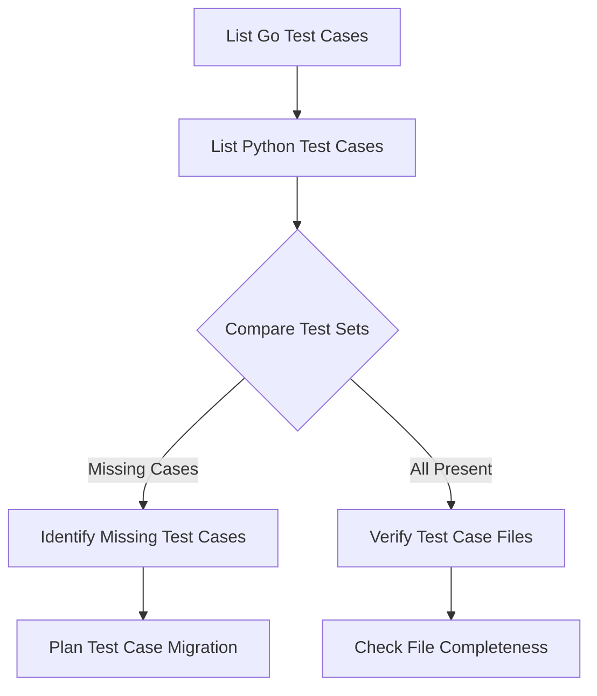
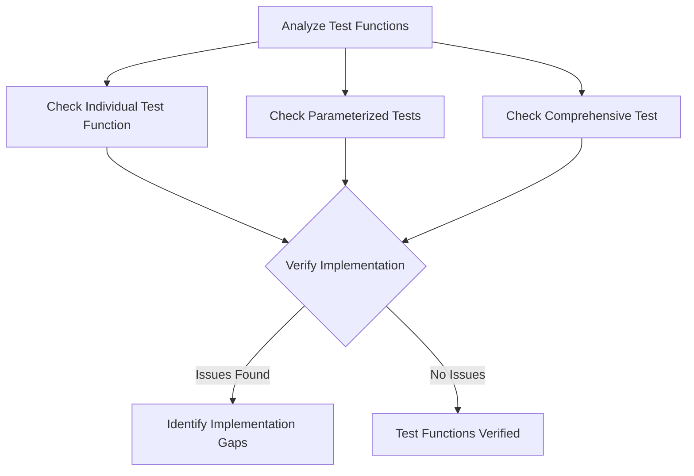

# Test Verification Plan for Python Readability

This plan outlines a systematic approach to verify if all tests for the Python Readability project are properly implemented. The goal is to ensure comprehensive test coverage and proper test implementation before proceeding with running the tests and debugging any failures.

## 1. Test Case Coverage Analysis

### 1.1 Compare Test Cases Between Go and Python Implementations

**Steps:**
1. Create a comprehensive inventory of test cases in `go-readability/test-pages/`
2. Create a comprehensive inventory of test cases in `tests/test-pages/`
3. Compare the two sets to identify any missing test cases in the Python implementation
4. For each test case, verify that all required files are present:
   - `source.html`: Input HTML
   - `expected.html`: Expected output HTML
   - `expected-metadata.json`: Expected metadata (if applicable)
5. Create a plan to migrate any missing test cases from Go to Python implementation

### 1.2 Categorize Test Cases by Feature

**Steps:**
1. Analyze each test case to determine which feature or aspect of the library it tests
2. Categorize test cases into groups:
   - Basic functionality tests
   - Metadata extraction tests
   - Content extraction tests
   - Edge case tests
   - Real-world website tests
3. Verify that each important feature has at least one test case

## 2. Test Function Implementation Verification

### 2.1 Analyze Test Functions in `test_readability.py`

**Steps:**
1. Review the `test_individual_case` function to ensure it:
   - Properly loads test case files
   - Initializes the parser with appropriate settings
   - Calls the parser with correct parameters
   - Performs appropriate assertions on the results
   - Handles errors correctly
   - Saves debug output for analysis

2. Review the parameterized test function `test_specific_cases` to ensure:
   - It includes all important test cases
   - The parameterization is correctly implemented
   - It calls the individual test function correctly

3. Review the comprehensive test function `test_all_cases` to ensure:
   - It properly uses the test case fixture
   - It handles errors and failures appropriately
   - It provides useful debugging information

### 2.2 Verify Test Helper Functions in `conftest.py`

**Steps:**
1. Review the test case discovery function `discover_test_cases` to ensure it:
   - Correctly identifies all test case directories
   - Handles edge cases (empty directories, non-standard naming)

2. Review the test case loading function `load_test_case` to ensure it:
   - Correctly loads all required files
   - Handles missing files appropriately
   - Creates proper mock URLs for testing

3. Review the HTML comparison function `compare_html` to ensure it:
   - Normalizes HTML correctly
   - Compares relevant aspects of the HTML
   - Provides useful comparison metrics

4. Review the metadata comparison function `compare_metadata` to ensure it:
   - Maps fields correctly between expected and actual metadata
   - Handles special cases (dates, optional fields)
   - Provides useful comparison results

### 2.3 Verify Debug Tools in `debug_tools.py`

**Steps:**
1. Review the HTML diff generation function to ensure it:
   - Creates useful visual diffs
   - Handles large HTML documents

2. Review the debug output saving function to ensure it:
   - Saves all relevant information
   - Organizes output in a useful way
   - Handles file writing errors

## 3. Test Configuration Verification

### 3.1 Verify pytest Configuration

**Steps:**
1. Check if there's a pytest configuration file (`pytest.ini` or `conftest.py` settings)
2. Verify that the configuration includes:
   - Appropriate test discovery settings
   - Useful output formatting
   - Any necessary plugins (e.g., pytest-cov for coverage)

### 3.2 Verify Test Environment Setup

**Steps:**
1. Check if the test environment setup is properly documented
2. Verify that any required dependencies for testing are included in `pyproject.toml`
3. Check if there are any environment-specific settings that need to be configured

## 4. Gap Analysis and Recommendations

### 4.1 Identify Testing Gaps

**Steps:**
1. Based on the analysis, identify any gaps in:
   - Test case coverage
   - Test function implementation
   - Comparison functions
   - Debug tools

2. For each gap, determine:
   - Severity (critical, important, minor)
   - Effort required to address
   - Impact on test reliability

### 4.2 Create Recommendations

**Steps:**
1. Create a prioritized list of recommendations to address identified gaps
2. For each recommendation, provide:
   - Specific actions to take
   - Expected outcome
   - Implementation guidance

## 5. Implementation Plan

### 5.1 Test Case Migration Plan

If missing test cases are identified, create a detailed plan for migrating them:

1. For each missing test case:
   - Copy source.html, expected.html, and expected-metadata.json from Go to Python test directories
   - Verify file encoding and format compatibility
   - Add the test case to the parameterized test list

### 5.2 Test Function Enhancement Plan

If issues with test functions are identified, create a plan to address them:

1. For each issue:
   - Describe the specific changes needed
   - Provide code examples or pseudocode
   - Explain the rationale for the changes

### 5.3 Comparison Function Improvement Plan

If issues with comparison functions are identified, create a plan to address them:

1. For each issue:
   - Describe the specific changes needed
   - Provide code examples or pseudocode
   - Explain how the changes will improve test reliability

## 6. Execution Plan

### 6.1 Verification Tasks

1. Create a script to compare Go and Python test cases
2. Manually review test functions and comparison helpers
3. Document findings in a structured format

### 6.2 Implementation Tasks

1. Prioritize and implement recommendations from the gap analysis
2. Migrate any missing test cases
3. Enhance test functions as needed
4. Improve comparison functions as needed

### 6.3 Validation Tasks

1. Run tests with the enhanced infrastructure
2. Verify that the tests are properly detecting issues
3. Document any remaining concerns or limitations

## 7. Expected Outcomes

After completing this verification and enhancement process:

1. All test cases from the Go implementation will be available in the Python implementation
2. Test functions will properly exercise all aspects of the library
3. Comparison functions will reliably detect differences between expected and actual results
4. Debug tools will provide useful information for troubleshooting
5. The testing infrastructure will be ready for comprehensive testing of the Python Readability implementation